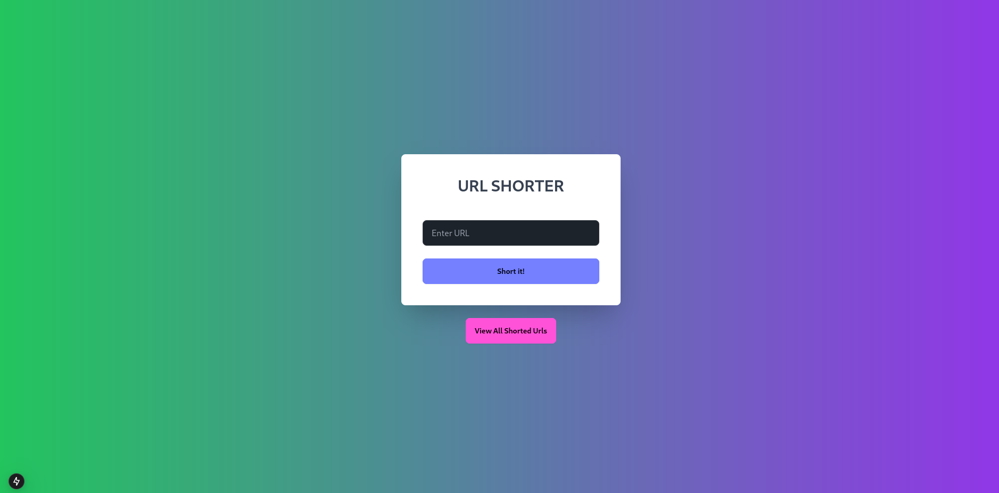

# Short URL - A URL Shortening Application

This is a [Next.js](https://nextjs.org) project that allows users to shorten long URLs by generating short, shareable links. The project was bootstrapped with [`create-next-app`](https://nextjs.org/docs/app/api-reference/cli/create-next-app).

## Features
- Shorten any long URL to a concise, shareable short URL.
- User-friendly interface with quick and responsive URL shortening.
- Dynamic display of all generated short URLs.
- Built with Next.js for fast and modern development.

## Screenshots
Below is a screenshot of the homepage:



## Getting Started

Follow the steps below to run the application locally:

### Prerequisites
Ensure you have Node.js and npm installed. You can download them from [Node.js official site](https://nodejs.org).

### Installation
1. Clone the repository:
   ```bash
   git clone https://github.com/Abhay2004Kumar/shortUrl.git
   cd short-url
   ```

2. Install dependencies:
   ```bash
   npm install
   # or
   yarn install
   ```

### Running the Development Server
Start the development server by running:
```bash
npm run dev
# or
yarn dev
# or
pnpm dev
# or
bun dev
```

Open [http://localhost:3000](http://localhost:3000) with your browser to view the app.

### Making Changes
You can edit the homepage by modifying `app/page.tsx`. Any changes will automatically update the page in real-time.

## Built With
- **Next.js**: A React framework for building modern web applications.
- **TypeScript**: For type-safe JavaScript development.
- **CSS**: For styling the application.

## Learn More

To learn more about Next.js, check out these resources:

- [Next.js Documentation](https://nextjs.org/docs) - Learn about Next.js features and API.
- [Learn Next.js](https://nextjs.org/learn) - Interactive tutorials for Next.js.

## Deployment

You can deploy this application on the [Vercel Platform](https://vercel.com/new?utm_medium=default-template&filter=next.js&utm_source=create-next-app&utm_campaign=create-next-app-readme), which is the recommended platform for deploying Next.js applications.

Refer to the [Next.js deployment documentation](https://nextjs.org/docs/app/building-your-application/deploying) for more details.

## Feedback and Contributions
We welcome feedback and contributions! Feel free to open an issue or submit a pull request to the project repository.

---

**Happy URL shortening!**

